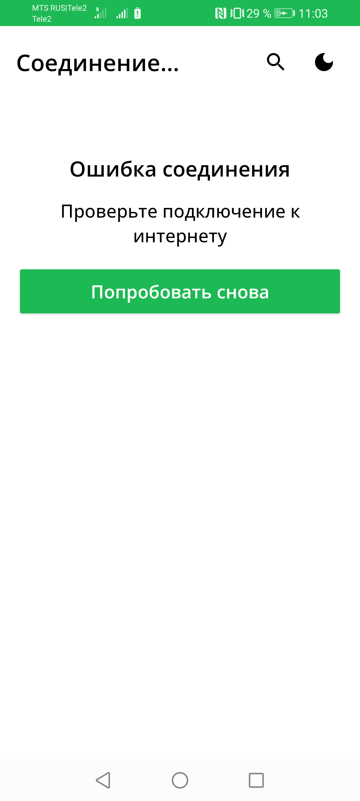
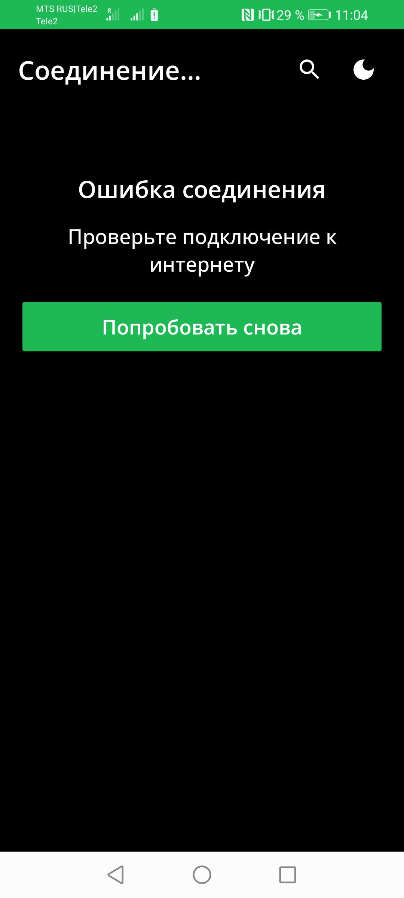
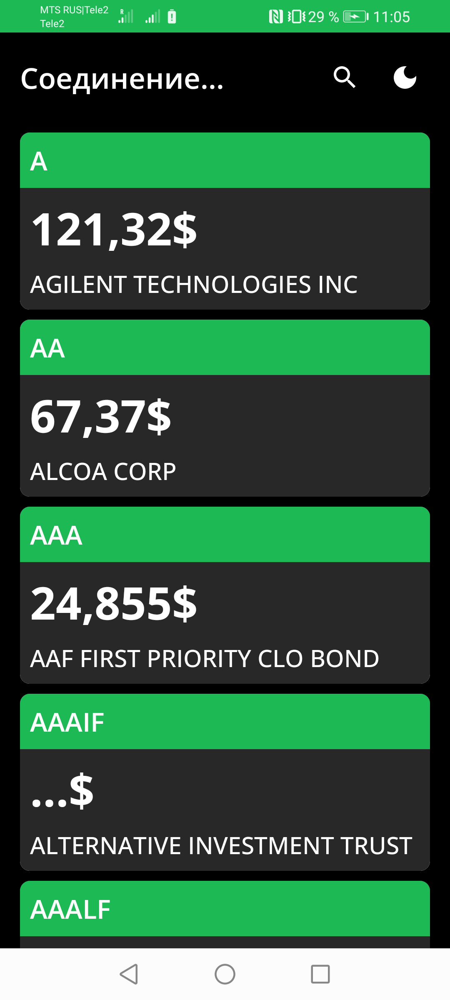

# Stockapp
Приложение для конкурса https://volga-it.org/

API: https://finnhub.io/

Задание: https://volga-it.org/wp-content/plugins/wp-olymp/files/10b3bb405cbe7a8cacebf2e25e6427ec.pdf

**Предупреждение:** *К сожалению на эмуляторе BroadcastReceiver для интернет соединения некорректно работает, поэтому рекомендую тестировать на реальном устройстве.*

Скрины приложения:

<table>
  <tr>
    <td></td>
    <td></td>
    <td></td>
  </tr>
  
  <tr>
    <td></td>
    <td></td>
    <td></td>
  </tr>
  
  <tr>
    <td></td>
    <td></td>
    <td></td>
  </tr>
  
</table>
